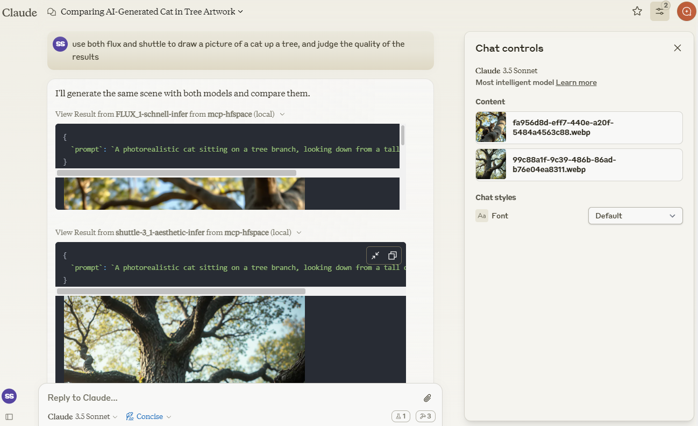
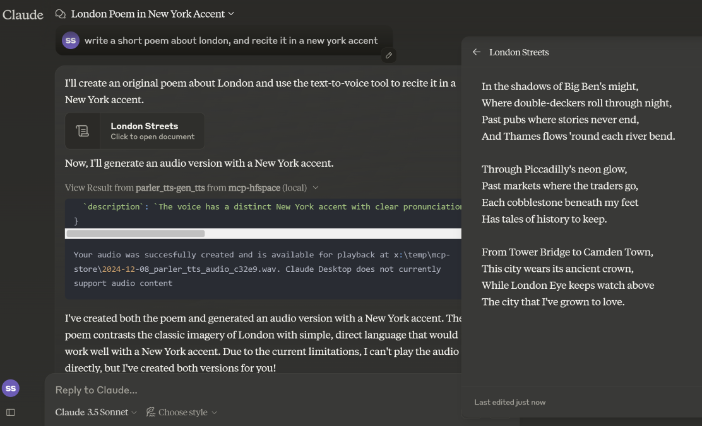
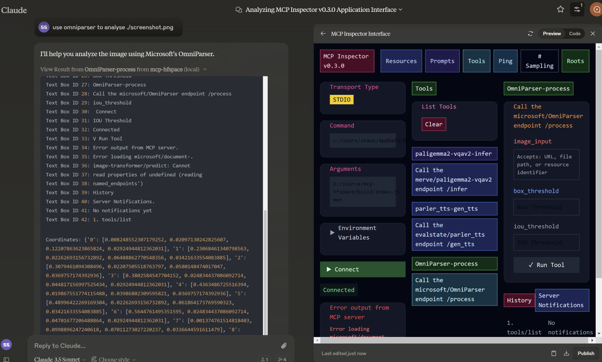

# mcp-hfspace MCP Server 🤗

Connect to [HuggingFace Spaces](https://huggingface.co/)  with minimal configuration needed - simply add your spaces and go!

With no configuration, it automatically connects to `evalstate/FLUX.1-schnell` providing Image Generation capabilities by default.

## Basic setup

Supply a list of HuggingFace spaces in the arguments. mcp-hfspace will find the most appropriate endpoint and automatically configure for usage. An example `claude_desktop_config.json` is supplied [below.](#installation)

By default the current working directory is used for file upload/download.

On Windows this is a read/write folder at `\users\<username>\AppData\Roaming\Claude\<version.number\`, and on MacOS is the root: `/`.

It is recommended to override this and set  a Working Directory for handling upload and download of images and other file-based content. Specify either the `--work-dir=/your_directory` argument or `MCP_HF_WORK_DIR` environment variable.

To use private spaces, supply your Hugging Face Token with either the  `--hf-token=hf_...` argument or `HF_TOKEN` environment variable.

It's possible to run multiple server instances to use different working directories and tokens if needed.

## File Handling and Claude Desktop Mode

By default, the Server operates in _Claude Desktop Mode_. In this mode, Images are returned directly in the tool responses, while other binaries are saved in the working folder and a message is returned with the URI. This will usually give the best experience if using Claude Desktop as the client.

### Example 1 - Image Generation (Download Image / Claude Vision)

We'll use `shuttleai/shuttle-3.1-aesthetic` to generate an image. The image gets saved to the Work Directory, as well as included in Claude's context window - so we can use  Claude's vision capabilities.



### Example 2 - Image Recognition (Upload Image)

We'll use `big-vision/paligemma-hf` to ask a question of an image. In this case, we specify the filename which is available in the Working Directory: we  don't want to upload the Image directly to Claude's context window. So, we can ask Claude:

`paligemma to identify who is in the picture "bowie.jpg"` -> `Text Output: david bowie`

_If you are uploading something to Claude's context use the Paperclip Attachment button, otherwise specify the filename for the Server to send directly._

### Example 3 - Text-to-Speech (Download Audio)

In _Claude Desktop Mode_, the audio file is saved in the WORK_DIR, and Claude is. If not in desktop mode, the file is returned base64 encoded to the Client (useful if it supports embedded Audio attachments).



### Example 4 - Speech-to-Text (Upload Audio)

### Example 5 - Image-to-Image

In this example, we specify the filename for the `microsoft/OmniParser` to use, and get returned an annotated Image and 2 separate pieces of text: descriptions and coordinates. The prompt used was `use omniparser to analyse ./screenshot.png` and `use the analysis to produce an artifact that reproduces that screen`.



### Specifying API Endpoint

If you need, you can specify a specific API Endpoint by adding it to the spacename. So rather than passing in `Qwen/Qwen2.5-72B-Instruct` you would use `Qwen/Qwen2.5-72B-Instruct/model_chat`.

### Claude Desktop Mode

This can be disabled with the option --desktop-mode=false or the environment variable CLAUDE_DESKTOP_MODE=false. In this case, content as returned as an embedded Base64 encoded Resource.

## Recommended Spaces

Some recommended spaces to try:

- shuttleai/shuttle-3.1-aesthetic
- black-forest-labs/FLUX.1-schnell
- Qwen/Qwen2.5-72B-Instruct

### Image-to-Image

- yanze/PuLID-FLUX

### Text-to-speech

- parler-tts/parler_tts
- suno/bark

### Speech-to-text

- hf-audio/whisper-large-v3-turbo

### Text-to-music

haoheliu/audioldm2-text2audio-text2music

### Vision Tasks

- merve/paligemma2-vqav2

## Other Features

### Prompts

Prompts for each Space are generated, and provide an opportunity to input. Bear in mind that often Spaces aren't configured with particularly helpful labels etc. Claude is actually very good at figuring this out, and the Tool description is quite rich (but not visible in Claude Desktop).

### Private Spaces

Private Spaces are supported with a HuggingFace token. The Token is used to download and save content.

## Installation

To use with Claude Desktop, add the server config:

On MacOS: `~/Library/Application Support/Claude/claude_desktop_config.json`
On Windows: `%APPDATA%/Claude/claude_desktop_config.json`

```json
{
  "mcpServers": {
    "mcp-hfspace": {
      "command": "npx"
      "args:" [
        "-y",
        "@llmindset/mcp-hfspace",
        "--work-dir=~/mcp-files/ or x:/temp/mcp-files/",
        "--HF_TOKEN=HF_{optional token}"
        "Qwen/Qwen2-72B-Instruct",
        "black-forest-labs/FLUX.1-schnell",
        "space/example/specific-endpint"
        (... and so on)
        ]
    }
  }
}
```

## Known Issues and Limitations

### mcp-hfspace

- Endpoints with unnamed parameters are unsupported for the moment.

### Claude Desktop

- Claude Desktop 0.75 doesn't seem to respond to errors from the MCP Server, timing out instead. For persistent issues, use the MCP Inspector to get a better look at diagnosing what's going wrong. If something suddenly stops working, it's probably a quota issue.
- Claude Desktop seems to use a hard timeout value of 60s, and doesn't seem to use Progress Notifications to manage UX alive. If you are using ZeroGPU spaces, large/heavy jobs may timeout. Check the WORK_DIR for results though; the MCP Server will still capture the result.
- Claude Desktops reporting of Server Status, logging etc. isn't great - use [@modelcontextprotocol/inspector](https://github.com/modelcontextprotocol/inspector) to help diagnose issues.

### HuggingFace Spaces

- If ZeroGPU quotas or queues are too long, try duplicating the space. If your job takes less than sixty seconds, you can usually change the Python `@space[]` decorator to acquire less quota when running the job.
- If you have a HuggingFace account, The Gradio API does not use your professional account.
- If ZeroGPU quotas become an issue, try duplicating the space, make it private, use dedicated hardware and use HF_TOKEN to access.
