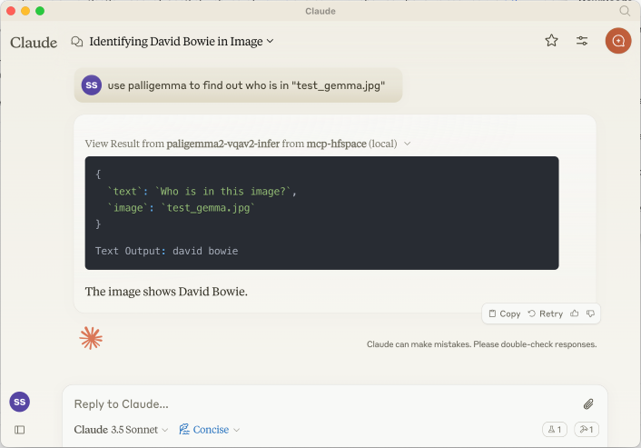
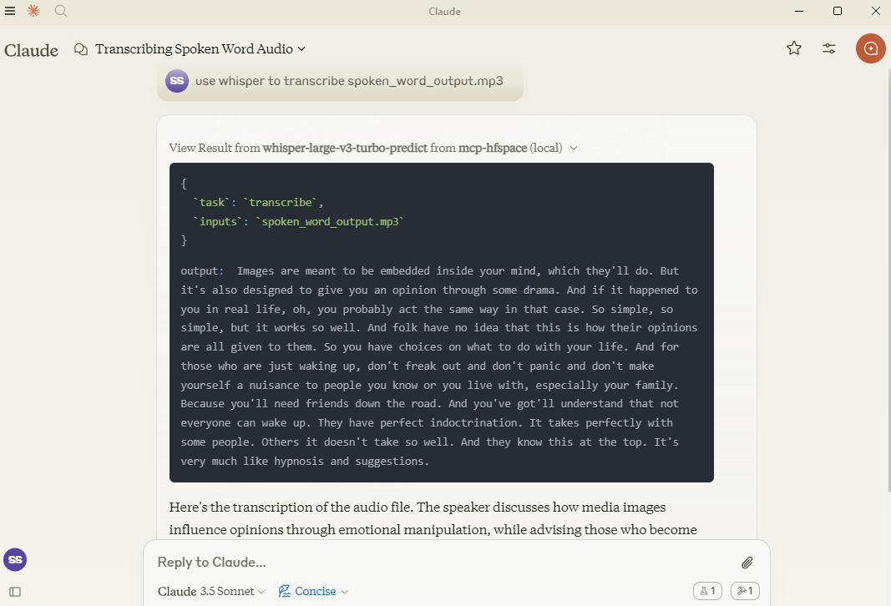
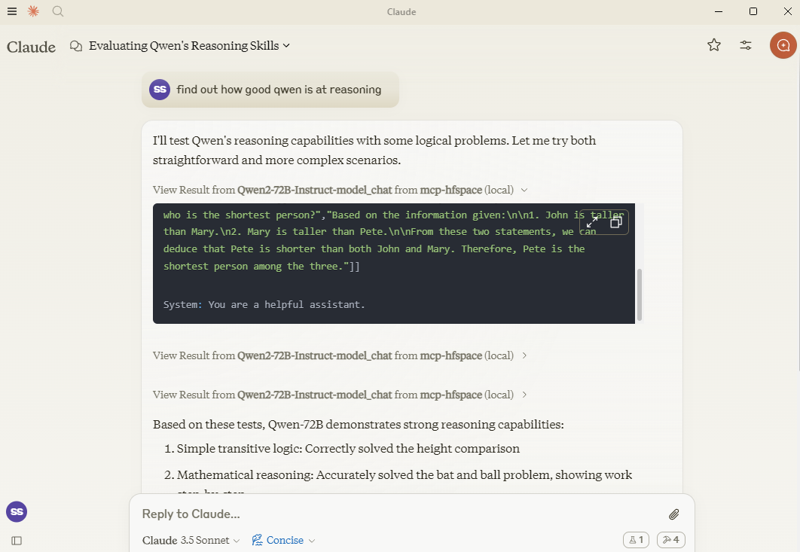

# mcp-hfspace MCP Server 🤗

Use NPX `@llmindset/mcp-hfspace` or download and build from here.

Connect to [Hugging Face Spaces](https://huggingface.co/spaces)  with minimal setup needed - simply add your spaces and go!

By default, it connects to `evalstate/FLUX.1-schnell` providing Image Generation capabilities to Claude Desktop.


## Basic setup

Supply a list of HuggingFace spaces in the arguments. mcp-hfspace will find the most appropriate endpoint and automatically configure for usage. An example `claude_desktop_config.json` is supplied [below.](#installation)

By default the current working directory is used for file upload/download.

On Windows this is a read/write folder at `\users\<username>\AppData\Roaming\Claude\<version.number\`, and on MacOS it is the is the read-only root: `/`.

It is recommended to override this and set  a Working Directory for handling upload and download of images and other file-based content. Specify either the `--work-dir=/your_directory` argument or `MCP_HF_WORK_DIR` environment variable.

To use private spaces, supply your Hugging Face Token with either the  `--hf-token=hf_...` argument or `HF_TOKEN` environment variable.

It's possible to run multiple server instances to use different working directories and tokens if needed.

## File Handling and Claude Desktop Mode

By default, the Server operates in _Claude Desktop Mode_. In this mode, Images are returned directly in the tool responses, while other binaries are saved in the working folder and a message is returned with the path. This will usually give the best experience if using Claude Desktop as the client.

URLs can also be supplied as inputs - the content gets passed to the Space.

### Example 1 - Image Generation (Download Image / Claude Vision)

We'll use Claude to compare images created by `shuttleai/shuttle-3.1-aesthetic` and `FLUX.1-schnell`. The images gets saved to the Work Directory, as well as included in Claude's context window - so Claude can use its vision capabilities.


### Example 2 - Vision Model (Upload Image)

We'll use `merve/paligemma2-vqav2` [space link](https://huggingface.co/spaces/merve/paligemma2-vqav2) to query an image. In this case, we specify the filename which is available in the Working Directory: we  don't want to upload the Image directly to Claude's context window. So, we can prompt Claude:

`use paligemma to find out who is in "test_gemma.jpg"` -> `Text Output: david bowie`


_If you are uploading something to Claude's context use the Paperclip Attachment button, otherwise specify the filename for the Server to send directly._

We can also supply a URL. For example : `use paligemma to detect humans in https://e3.365dm.com/24/12/1600x900/skynews-taylor-swift-eras-tour_6771083.jpg?20241209000914` -> `One person is detected in the image - Taylor Swift on stage.`

### Example 3 - Text-to-Speech (Download Audio)

In _Claude Desktop Mode_, the audio file is saved in the WORK_DIR, and Claude is notified of the creation. If not in desktop mode, the file is returned base64 encoded to the Client (useful if it supports embedded Audio attachments).


### Example 4 - Speech-to-Text (Upload Audio)

Here, we use `hf-audio/whisper-large-v3-turbo` to transcribe some audio, and make it available to Claude.



### Example 5 - Image-to-Image

In this example, we specify the filename for `microsoft/OmniParser` to use, and get returned an annotated Image and 2 separate pieces of text: descriptions and coordinates. The prompt used was `use omniparser to analyse ./screenshot.png` and `use the analysis to produce an artifact that reproduces that screen`.


### Example 6 - Chat

In this example, Claude sets a number of reasoning puzzles for Qwen, and asks follow-up questions for clarification.



### Specifying API Endpoint

If you need, you can specify a specific API Endpoint by adding it to the spacename. So rather than passing in `Qwen/Qwen2.5-72B-Instruct` you would use `Qwen/Qwen2.5-72B-Instruct/model_chat`.

### Claude Desktop Mode

This can be disabled with the option --desktop-mode=false or the environment variable CLAUDE_DESKTOP_MODE=false. In this case, content as returned as an embedded Base64 encoded Resource.

## Recommended Spaces

Some recommended spaces to try:

### Image Generation

- shuttleai/shuttle-3.1-aesthetic
- black-forest-labs/FLUX.1-schnell
- yanze/PuLID-FLUX

### Chat

- Qwen/Qwen2.5-72B-Instruct
- prithivMLmods/Mistral-7B-Instruct-v0.3

### Text-to-speech / Audio Generation

- Sound-AI-SFX-predict
- parler-tts/parler_tts

### Speech-to-text

- hf-audio/whisper-large-v3-turbo
- (the openai models use unnamed parameters so will not work)

### Text-to-music

- haoheliu/audioldm2-text2audio-text2music

### Vision Tasks

- microsoft/OmniParser
- merve/paligemma2-vqav2
- merve/paligemma-doc
- DawnC/PawMatchAI 
- DawnC/PawMatchAI/on_find_match_click - for interactive dog recommendations

## Other Features

### Prompts

Prompts for each Space are generated, and provide an opportunity to input. Bear in mind that often Spaces aren't configured with particularly helpful labels etc. Claude is actually very good at figuring this out, and the Tool description is quite rich (but not visible in Claude Desktop).

### Resources

A list of files in the WORK_DIR is returned, and as a convenience returns the name as "Use the file..." text. If you want to add something to Claude's context, use the paperclip - otherwise specify the filename for the MCP Server. Claude does not support transmitting resources from within Context.

### Private Spaces

Private Spaces are supported with a HuggingFace token. The Token is used to download and save content.

## Installation

To use with Claude Desktop, add the server config:

On MacOS: `~/Library/Application Support/Claude/claude_desktop_config.json`
On Windows: `%APPDATA%/Claude/claude_desktop_config.json`

```json
{
  "mcpServers": {
    "mcp-hfspace": {
      "command": "npx"
      "args:" [
        "-y",
        "@llmindset/mcp-hfspace",
        "--work-dir=~/mcp-files/ or x:/temp/mcp-files/",
        "--HF_TOKEN=HF_{optional token}"
        "Qwen/Qwen2-72B-Instruct",
        "black-forest-labs/FLUX.1-schnell",
        "space/example/specific-endpint"
        (... and so on)
        ]
    }
  }
}
```

## Known Issues and Limitations

### mcp-hfspace

- Endpoints with unnamed parameters are unsupported for the moment.
- Full translation from some complex Python types to suitable MCP formats.

### Claude Desktop

- Claude Desktop 0.75 doesn't seem to respond to errors from the MCP Server, timing out instead. For persistent issues, use the MCP Inspector to get a better look at diagnosing what's going wrong. If something suddenly stops working, it's probably a quota issue.
- Claude Desktop seems to use a hard timeout value of 60s, and doesn't seem to use Progress Notifications to manage UX alive. If you are using ZeroGPU spaces, large/heavy jobs may timeout. Check the WORK_DIR for results though; the MCP Server will still capture the result.
- Claude Desktops reporting of Server Status, logging etc. isn't great - use [@modelcontextprotocol/inspector](https://github.com/modelcontextprotocol/inspector) to help diagnose issues.

### HuggingFace Spaces

- If ZeroGPU quotas or queues are too long, try duplicating the space. If your job takes less than sixty seconds, you can usually change the decorate `@spaces.GPU(duration=20)` in `app.py` to request less quota when running the job.
- If you have a HuggingFace Pro account, please note that The Gradio API does not your additional quote for ZeroGPU jobs - you will need to set an `X-IP-Token` header to achieve that.
- If you have a private space, and dedicated hardware your HF_TOKEN will give you direct access to that - no quota's apply. I recommend this if you are using for any kind of Production task.
